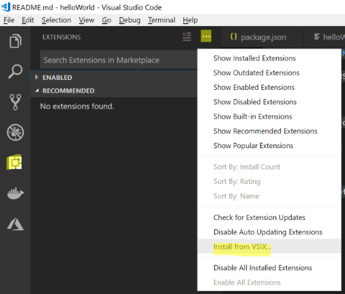

# Instructions

Dans cet atelier, nous allons découvrir comment créer un package d'application pour une distribution en side-loading, hors MarketPlace.

## Initialiser le workspace

Ouvrez le dossier contenant le code de votre extension depuis VS Code.

## Description de votre extension

Ouvrez le fichier `Readme.md` et remplacez le contenu avec le code suivant :

```bash
# helloWorld README

This is THE FAMOUS 'HelloWorld' extension.

## Features

This extension provides a command showing a wonderfull '**Hello World**' message.

## Release Notes

### 1.0.0

Initial release of HelloWorld extension !
```

## Respository

Vous pouvez ajouter un lien vers le repository de votre code source si vous souhaitez que celui-ci apparaisse dans la fiche de votre extension.
Pour cela, ajoutez la propriété suivante au fichier `package.json` :
```javascript
"repository": {
    "type": "git",
    "url": "https://github.com/myaccount/myrepo"
},
```
## Créer le package

Pour créer le package, lancez la commande suivante depuis le terminal :

```bash
vsce package
```

Un lien vers le fichier *vsix* de votre installation doit alors appraître :
`Created: C:\Users\micha\source\tmp\vsce\helloWorld\helloWorld-0.0.1.vsix (8 files, 21.94KB)`

## Installer votre extension depuis le package

Pour installer une extension depuis le package vsix, il vous faut ouvrir le menu `Extensions` puis cliquer sur `...` et enfin, choisir `Install from VSIX`. 



Il ne vous reste alors qu'à choisir le package généré à l'étape précédente.
