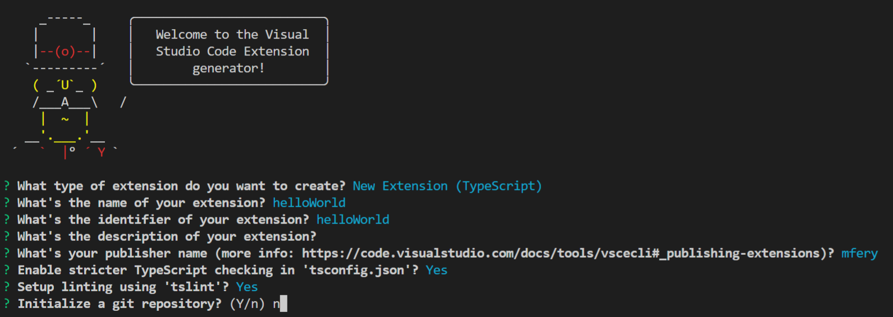
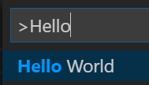
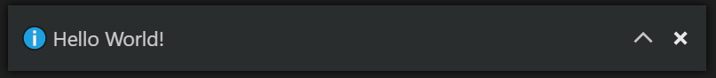
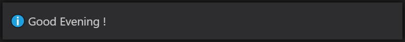

# Instructions

Dans cet atelier, nous allons créer une extension simple permettant de répondre à une commande en affichant une fenêtre de message.
Nous découvrirons les éléments définissant les commandes et l"API de

## Initialiser le workspace

Créer un nouveau dossier "techlabs", et ouvrir celui-ci dans VS Code ou une fenêtre de commande.

## Générer l'extension

```bash
yo code
```

Renseignez les paramètres suivants : 
* type : **New Extension (TypeScript)**
* name : **helloWorld**
* identifier : **helloWorld**
* description : **ma première extension**
* publisher name : **votre publisher name**
* Enable stricter TypeScript checking : **Y**
* Setup linting using 'tslint' : **Y**



Un nouveau dossier **helloWorld** a été créé.

## Initialiser le workspace

```bash
cd helloWorld
code .
```

Une nouvelle fenêtre VS Code doit alors s'ouvrir sur le dossier de votre extension nouvellement créée. 

## Debug de l'extension

Appuyez sur `F5`

Une nouvelle fenêtre VS Code doit s'ouvrir intitulée `Extension Development Host`.
Dans cette fenêtre, vous pouvez utiliser votre extension.

## Exécution de la commande

Appuyez sur `Ctrl + Shift + P` pour Windows (`Cmd +Shift + P` pour Mac) et lancez la commande `Hello World`.



Une fenêtre de message doit alors apparaître avec le message `Hello World`.



## Modifier la commande

Ouvrez le fichier *package.json* et remplacez le code suivant :

```javascript
"commands": [
    {
        "command": "extension.sayHello",
        "title": "Say Good Evening"
    }
]
```

Ouvrez le fichier *extension.ts* et remplacez le code suivant :

```javascript
// Display a message box to the user
vscode.window.showInformationMessage('Good Evening !');
```

Appuyez sur `F5` pour lancer l'extension et lancez la commande `Say Good Evening`.
Vous devriez alors voir le message suivant :


